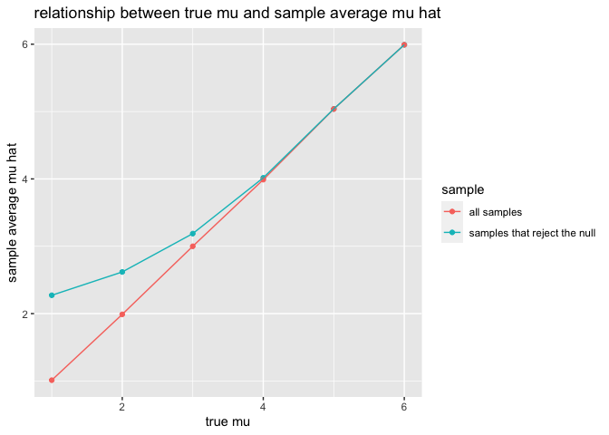

P8105 HW5
================
Yijin Serena Wang
2022-11-16

``` r
library(tidyverse)
library(purrr)
library(readr)
library(janitor)
library(broom)
library(stats)
library(ggplot2)
```

## Problem 1

Find all available csv files in p1_data folder and load them all.

``` r
file_paths <- list.files("./p1_data", full.names = TRUE)
participant_data <- tibble(file_name = str_replace(file_paths, "./p1_data/","")) %>%
  mutate(data = map(.x = file_paths, ~read_csv(file = .x)))
```

Clean up the data set: 1. Split the full file name into only arm_id,
then split it into separate columns for arm and id. 2. Pivot the data
frame so that each row is for a weekly observation for a participant on
a specific arm.

``` r
participant_data <- participant_data %>%
  mutate(file_name = str_replace(file_name, ".csv","")) %>%
  unnest(data) %>%
  clean_names() %>%
  separate(col = c(file_name),
           sep = "_",
           into = c("arm", "id")) %>%
  mutate(arm  = ifelse(arm == "exp", "experimental", "control")) %>%
  pivot_longer(cols = starts_with("week_"),
               names_to = "week",
               values_to = "value") %>%
  mutate(week = str_replace(week, "week_",""),
         week = as.numeric(week))
```

``` r
head(participant_data)
```

    ## # A tibble: 6 × 4
    ##   arm     id     week value
    ##   <chr>   <chr> <dbl> <dbl>
    ## 1 control 01        1  0.2 
    ## 2 control 01        2 -1.31
    ## 3 control 01        3  0.66
    ## 4 control 01        4  1.96
    ## 5 control 01        5  0.23
    ## 6 control 01        6  1.09

Plot all weekly readings and color it by arm and id number

``` r
participant_data %>%
  ggplot(aes(x = week, y = value, color = interaction(id, arm))) +
  geom_line() +
  facet_grid(.~arm) +
  theme(legend.position = "bottom")+
  labs(color = "id with arm",
       title = "Comparison of weekly observation in each arm")
```

<!-- -->

All subjects in the experimental arm have a clear upward trend in their
weekly measurement over time. On the other hand, all subjects in the
control arm have small fluctuations around their initial measurement.

## Problem 2

The raw data contains information about criminal homicides in the last
10 years in the US. It includes 52179 observations. They have victim’s
information, specific location of homicide, whether an arrest was made.

Save the data to a local path and create a city state column by merging
the city and state columns.

``` r
homicide_data <- read_csv("./p2_data/homicide-data.csv") 
```

    ## Rows: 52179 Columns: 12
    ## ── Column specification ────────────────────────────────────────────────────────
    ## Delimiter: ","
    ## chr (9): uid, victim_last, victim_first, victim_race, victim_age, victim_sex...
    ## dbl (3): reported_date, lat, lon
    ## 
    ## ℹ Use `spec()` to retrieve the full column specification for this data.
    ## ℹ Specify the column types or set `show_col_types = FALSE` to quiet this message.

``` r
homicide_data[homicide_data$city == "Tulsa", ]$state <- "OK"

homicide_data <- homicide_data %>%
  mutate(city_state = paste0(city, ", ", state)) %>%
  clean_names() 
```

Count number of homicides and unsolved_homicides forr each city state.

``` r
homicide_summary <- homicide_data %>%
  group_by(city_state) %>%
  summarise(total_number_of_homicides = n(),
            number_of_unsolved_homicides = sum(disposition %in% c("Closed without arrest", "Open/No arrest"))) 

homicide_summary %>%
  knitr::kable(digits = 1)
```

| city_state         | total_number_of_homicides | number_of_unsolved_homicides |
|:-------------------|--------------------------:|-----------------------------:|
| Albuquerque, NM    |                       378 |                          146 |
| Atlanta, GA        |                       973 |                          373 |
| Baltimore, MD      |                      2827 |                         1825 |
| Baton Rouge, LA    |                       424 |                          196 |
| Birmingham, AL     |                       800 |                          347 |
| Boston, MA         |                       614 |                          310 |
| Buffalo, NY        |                       521 |                          319 |
| Charlotte, NC      |                       687 |                          206 |
| Chicago, IL        |                      5535 |                         4073 |
| Cincinnati, OH     |                       694 |                          309 |
| Columbus, OH       |                      1084 |                          575 |
| Dallas, TX         |                      1567 |                          754 |
| Denver, CO         |                       312 |                          169 |
| Detroit, MI        |                      2519 |                         1482 |
| Durham, NC         |                       276 |                          101 |
| Fort Worth, TX     |                       549 |                          255 |
| Fresno, CA         |                       487 |                          169 |
| Houston, TX        |                      2942 |                         1493 |
| Indianapolis, IN   |                      1322 |                          594 |
| Jacksonville, FL   |                      1168 |                          597 |
| Kansas City, MO    |                      1190 |                          486 |
| Las Vegas, NV      |                      1381 |                          572 |
| Long Beach, CA     |                       378 |                          156 |
| Los Angeles, CA    |                      2257 |                         1106 |
| Louisville, KY     |                       576 |                          261 |
| Memphis, TN        |                      1514 |                          483 |
| Miami, FL          |                       744 |                          450 |
| Milwaukee, wI      |                      1115 |                          403 |
| Minneapolis, MN    |                       366 |                          187 |
| Nashville, TN      |                       767 |                          278 |
| New Orleans, LA    |                      1434 |                          930 |
| New York, NY       |                       627 |                          243 |
| Oakland, CA        |                       947 |                          508 |
| Oklahoma City, OK  |                       672 |                          326 |
| Omaha, NE          |                       409 |                          169 |
| Philadelphia, PA   |                      3037 |                         1360 |
| Phoenix, AZ        |                       914 |                          504 |
| Pittsburgh, PA     |                       631 |                          337 |
| Richmond, VA       |                       429 |                          113 |
| Sacramento, CA     |                       376 |                          139 |
| San Antonio, TX    |                       833 |                          357 |
| San Bernardino, CA |                       275 |                          170 |
| San Diego, CA      |                       461 |                          175 |
| San Francisco, CA  |                       663 |                          336 |
| Savannah, GA       |                       246 |                          115 |
| St. Louis, MO      |                      1677 |                          905 |
| Stockton, CA       |                       444 |                          266 |
| Tampa, FL          |                       208 |                           95 |
| Tulsa, OK          |                       584 |                          193 |
| Washington, DC     |                      1345 |                          589 |

Run prop.test for Baltimore only.

``` r
baltimore_unsolved_test <- 
  prop.test(
  x = homicide_summary %>% 
    filter(city_state == "Baltimore, MD") %>%
    pull(number_of_unsolved_homicides),
  n = homicide_summary %>% 
    filter(city_state == "Baltimore, MD") %>%
    pull(total_number_of_homicides))

baltimore_unsolved_test %>% 
  tidy() %>%
  select(estimate, conf.low, conf.high) %>%
  knitr::kable(digits = 5)
```

| estimate | conf.low | conf.high |
|---------:|---------:|----------:|
|  0.64556 |  0.62756 |   0.66316 |

With 95% confidence level, estimated proportion is 0.64556 and estimated
confidence interval is (0.62756, 0.66316).

Run prop test on all city states

``` r
prop_test_results <- map2(
  .y  = homicide_summary$total_number_of_homicides,
  .x = homicide_summary$number_of_unsolved_homicides,
  ~prop.test(x = .x, n = .y) %>% 
    tidy() %>% 
    select(estimate, conf.low, conf.high)
)

prop_test_results <- homicide_summary %>%
  mutate(results = prop_test_results) %>%
  unnest(results) 
```

``` r
head(prop_test_results) %>%
  knitr::kable(digits = 3)
```

| city_state      | total_number_of_homicides | number_of_unsolved_homicides | estimate | conf.low | conf.high |
|:----------------|--------------------------:|-----------------------------:|---------:|---------:|----------:|
| Albuquerque, NM |                       378 |                          146 |    0.386 |    0.337 |     0.438 |
| Atlanta, GA     |                       973 |                          373 |    0.383 |    0.353 |     0.415 |
| Baltimore, MD   |                      2827 |                         1825 |    0.646 |    0.628 |     0.663 |
| Baton Rouge, LA |                       424 |                          196 |    0.462 |    0.414 |     0.511 |
| Birmingham, AL  |                       800 |                          347 |    0.434 |    0.399 |     0.469 |
| Boston, MA      |                       614 |                          310 |    0.505 |    0.465 |     0.545 |

Plot estimate and 95% confidence interval of proportion of unsolved
homicides

``` r
prop_test_results %>%
  ggplot(aes(group = city_state, x = reorder(city_state, estimate))) + 
  geom_point(aes(y = estimate)) +
  geom_errorbar(aes(ymin = conf.low, ymax = conf.high)) +
  theme(axis.text.x = element_text(angle = 60, hjust = 1)) +
  labs(x = "City state", 
       y = "Estimated % of unsolved homicides",
       title = "Unsolved homicides: estimates and 95% CI")
```

<!-- -->

## Problem 3

Set seed

``` r
set.seed(10)
```

Create a function for: 1. Generate a sample of size 30 from normal
distribution with specified mean and sd = 5. 2. Run a t test on the
sample with 95% confidence level, and extract estimate for mu and
p_value

``` r
sim_normal_t_test <- function(mu) {
  
  sample = rnorm(30, mean = mu, sd = 5)

  t.test(sample, conf.level = 1-0.05) %>%
    tidy() %>%
    select(estimate, p.value) %>%
    rename(p_value = p.value,
           mu_hat = estimate)
}
```

Generate 5000 samples of size 30 with mu = 0. Then run t-test of every
sample.

``` r
sim_results_df = 
  expand_grid(
    mu =  0,
    iter = 1:5000
  ) %>% 
  mutate(
    estimate_df = map(mu, sim_normal_t_test)
  ) %>% 
  unnest(estimate_df)
```

For each mu (from 1 to 6), generate 5000 samples of size 30. Then run
t-test of every sample.

``` r
sim_results_mu_df <- 
  tibble(mu = c(1:6)) %>%
  mutate(test_result_list = map(.x = mu, 
                                ~rerun(5000, sim_normal_t_test(mu = .x))),
         test_result = map(test_result_list, bind_rows)) %>%
  unnest(test_result) %>%
  select(-test_result_list)
```

Summarize the total number of samples and samples that reject the null
in t test. Then, plot rejection rate against true mu value.

``` r
sim_results_mu_df %>%
  group_by(mu) %>%
  summarize(total_count = n(),
            reject_count = sum(p_value < 0.05),
            reject_rate = reject_count/total_count) %>%
  ggplot(aes(x = mu, y = reject_rate)) +
  geom_bar(stat = "identity") +
  labs(
    x = "true mu",
    y = "rejection rate",
    title = "relationship between true mu and rejection rate"
  )
```

<!-- -->

Effect size is the difference between the true mu and the null value in
t-test. As the true mu increases, rejection rate grows as well. In other
words, power grows as effect size grows.

For each mu, calculate the average mu hat for all samples created and
average mu hat for samples that reject the null in t-tests. Plot two
averages against the true mu value.

``` r
sim_results_all_sample_mu_avg <- sim_results_mu_df %>%
  group_by(mu) %>%
  summarise(avg_mu_hat = mean(mu_hat),
            sample = "all samples") 

sim_results_mu_avg_comparison <- sim_results_mu_df %>%
  filter(p_value < 0.05) %>%
  group_by(mu) %>%
  summarise(avg_mu_hat = mean(mu_hat),
            sample = "samples that reject the null") %>%
  rbind(sim_results_all_sample_mu_avg)
  

sim_results_mu_avg_comparison %>%
  ggplot(aes(x = mu, y = avg_mu_hat, color = sample), group = sample) +
  geom_point()+
  geom_line() +
  labs(
    x = "true mu",
    y = "sample average mu hat",
    title = "relationship between true mu and sample average mu hat"
  )
```

<!-- -->

As the true mu increases, sample average mu hat increases as well.
Average mu hat of samples that reject the null is very close to the true
mu when the true mu is 4, 5, 6. When the true mu is less than 4, mu hat
of samples that reject the null is larger than the true mu.

This is because these samples come from a normal distribution whose true
mean is very different from the null value of 0. And the rejection rate
increases as true mean increases. Therefore, these samples would reject
the null in t-test and the average mu hat would be around the true mu.
